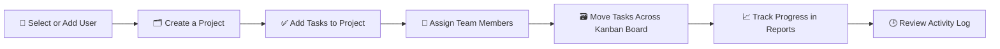
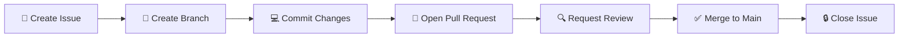
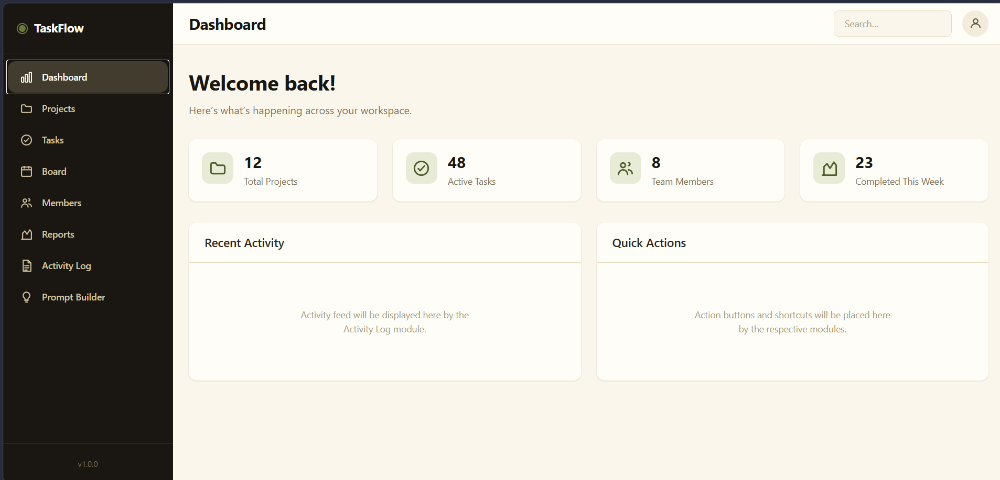
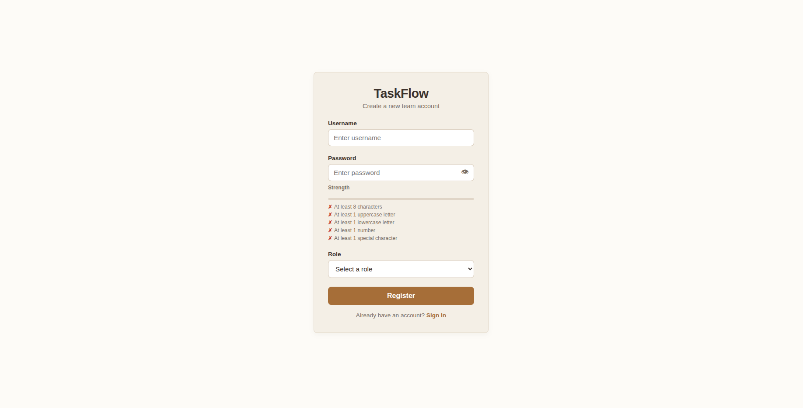
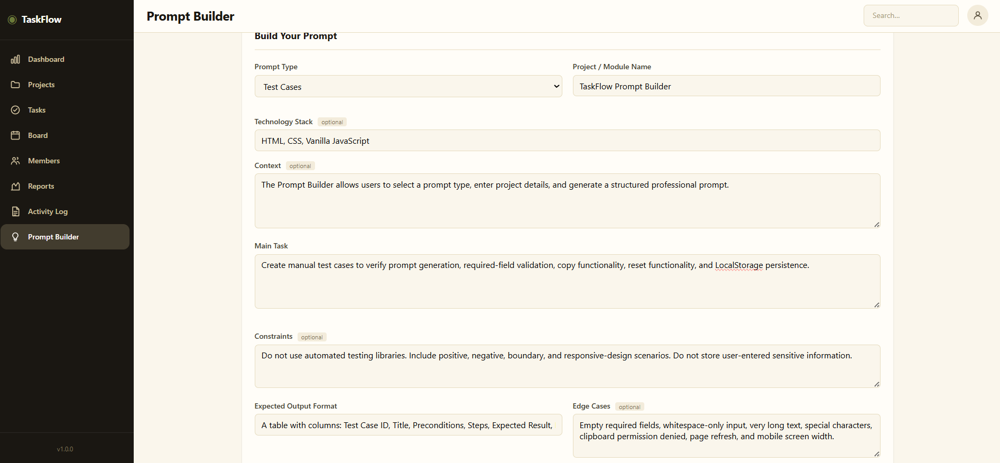
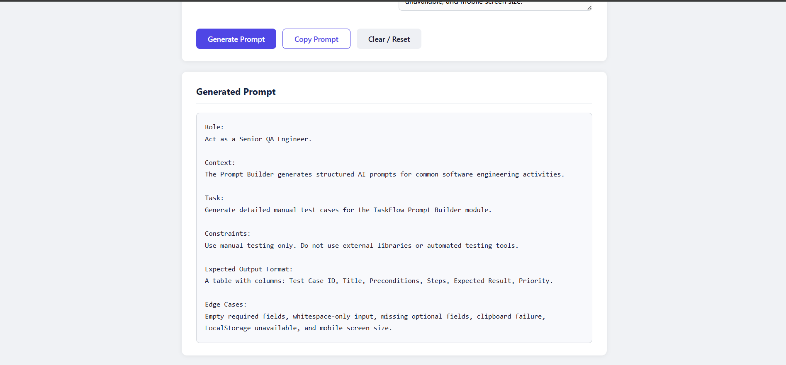

<div align="center">


<br/>


&nbsp;

&nbsp;


<br/><br/>

### ✨ Plan smarter. Ship faster. Built by a team of ten in two days.

</div>

<br/>

---

## 🚀 Quick Start

```bash
# Clone the repository
git clone https://github.com/meowryam/taskflow-management-system.git
cd taskflow-management-system

# Serve locally using Python
python3 -m http.server 8000
# Then open http://localhost:8000/index.html

# OR
# Serve using Node.js
npx serve .
```

> 💡 TaskFlow runs entirely in the browser using LocalStorage. Task creation uses ES modules, so always open the app through a local HTTP server rather than double-clicking `index.html`.

---

## 📋 Table of Contents

| # | Section |
|:--|:--------|
| 01 | [📖 Project Overview](#-project-overview) |
| 02 | [🎯 Feature Matrix](#-feature-matrix) |
| 03 | [🛠️ Tech Stack](#️-tech-stack) |
| 04 | [🗂️ Project Structure](#️-project-structure) |
| 05 | [⚙️ Setup and Installation](#️-setup-and-installation) |
| 06 | [📘 Usage Instructions](#-usage-instructions) |
| 07 | [🔀 GitHub Workflow Evidence](#-github-workflow-evidence) |
| 08 | [📅 Development Process](#-development-process) |
| 09 | [🧩 Day 1: The 10 Modules](#-day-1-the-10-modules) |
| 10 | [🤝 Day 2: Group Integration](#-day-2-group-integration) |
| 11 | [🤖 AI Usage and Prompt Engineering](#-ai-usage-and-prompt-engineering) |
| 12 | [🛡️ Responsible AI Policy](#️-responsible-ai-policy) |
| 13 | [🧪 Testing](#-testing) |
| 14 | [🖼️ Screenshots and Demo](#️-screenshots-and-demo) |
| 15 | [👥 Contributors](#-contributors) |
| 16 | [🔮 Future Improvements](#-future-improvements) |
| 17 | [📄 License](#-license) |
| 18 | [🙏 Acknowledgments](#-acknowledgments) |

---

## 📖 Project Overview

**TaskFlow** is a lightweight, browser-based team task management system built to help small teams create projects, assign work, track status, and stay on top of deadlines, all without needing a backend server.

TaskFlow was born out of a **2-Day Agentic Development Sprint**: a hands-on assessment where 10 interns used AI coding assistants (Cursor, Claude, Codex, GitHub Copilot) as professional development partners, not as a shortcut. Every line of AI generated code was manually verified, tested, and explained before it shipped.

### 💎 In a nutshell

- 📊 A dashboard that shows exactly where every project stands
- 🗂️ Full project lifecycle management, from creation to completion
- ✅ A Kanban board that keeps tasks moving
- 🧠 A built-in Prompt Builder that teaches good prompting habits
- 🔒 Built on a foundation of responsible, disclosed AI usage

<div align="center">

</div>

---

## 🎯 Feature Matrix

<div align="center">

| Feature | Icon | Description |
|:--------|:----:|:------------|
| **Dashboard** | 📊 | Summary cards and progress visibility across all projects |
| **Project Management** | 🗂️ | Full CRUD: create, edit, delete, view, and track project status |
| **Task Management** | ✅ | Assignment, priority, status, and due dates on every task |
| **Kanban Board** | 🗃️ | Drag tasks through Todo, In Progress, Review, and Done |
| **Team Members** | 👥 | Manage members with live task counts and safe deletion |
| **Search, Filter, Sort** | 🔍 | Combine multiple filters that work together, not separately |
| **Activity Log** | 🕒 | Timestamped history of every meaningful action |
| **Reports Dashboard** | 📈 | Analytics on completion rate, overdue tasks, and workload |
| **Prompt Builder** | 🧠 | Generates structured, professional AI prompts on demand |
| **Responsible AI Policy** | 🛡️ | Documented rules for safe, disclosed AI-assisted development |

</div>

---

## 🛠️ Tech Stack

<div align="center">

| Layer | Technology |
|:------|:-----------|
| 🎨 **Frontend** | HTML5, CSS3, JavaScript (Vanilla, ES6+) |
| 💾 **Storage** | Browser LocalStorage, structured for future backend integration |
| 🤖 **AI Tools Used** | Cursor, Claude, GitHub Copilot, OpenAI Codex, DeepSeek |
| 🌿 **Version Control** | Git and GitHub, full Issue to PR to Merge workflow |
| 🧪 **Testing** | Manual test cases and structured bug reports |

<br/>


&nbsp;

&nbsp;

&nbsp;

&nbsp;

&nbsp;


</div>

> 🧱 The codebase is intentionally structured as if it will one day connect to a real backend API. Data handling, validation, and separation of logic all follow that assumption.

---

## 🗂️ Project Structure

```
taskflow-management-system/
├── 🤖 .github/
│   └── workflows/                   # GitHub Actions workflows
│
├── 📚 docs/                         # Architecture, workflow, and contribution docs
│   ├── interns/                     # Per-intern module documentation
│   ├── screenshots/                 # App screenshots and demo images
│   └── templates/                   # PR and issue templates
│
├── 🧰 scripts/                      # Utility and setup scripts
│
├── 💻 src/                          # Application source (modules, data layer, styles)
│   ├── modules/                     # Feature modules (board, tasks, members, etc.)
│   ├── styles/                      # Per-module CSS files
│   └── dataStore.js                 # Shared LocalStorage persistence layer
│
├── 🧪 tests/                        # Manual test cases and QA documentation
│
├── 🚫 .gitignore
├── 🏠 index.html                    # Application entry point
├── 📘 README.md                     # This file
├── 📊 AI_usage_report.md            # Full AI usage and prompting log
├── 🛡️ RESPONSIBLE_AI_POLICY.md      # Team AI usage policy
└── 📝 changelog.md                  # Version history and release notes
```

> 📌 This mirrors the actual structure of the live repository. The original module-by-module folder plan from the assignment was consolidated into `src/` during Day 2 integration.

---

## ⚙️ Setup and Installation

<details open>
<summary><b>✅ Prerequisites</b></summary>
<br/>

- A modern web browser (Chrome, Firefox, Edge, or Safari)
- That is it. No Node.js, no npm, no build tools required.

</details>

<details open>
<summary><b>1️⃣ Clone the repository</b></summary>
<br/>

```bash
git clone https://github.com/meowryam/taskflow-management-system.git
cd taskflow-management-system
```

</details>

<details open>
<summary><b>2️⃣ Open the app</b></summary>
<br/>

Simply serve the project locally and open the app in your browser:

```bash
python3 -m http.server 8000
# Open http://localhost:8000/index.html
```

Task creation relies on ES modules, which browsers block on the `file://` protocol. Use a local server instead of double-clicking `index.html`.

```bash
# Alternative
npx serve .
```

</details>

<details open>
<summary><b>3️⃣ Start using TaskFlow</b></summary>
<br/>

On first load, LocalStorage initializes automatically with an empty state. No seed data, no configuration, no setup wizard. Just start creating projects.

</details>

---

## 📘 Usage Instructions

### 🧭 Navigating the App

TaskFlow is organized around a persistent sidebar giving quick access to the Dashboard, Projects, Task Board, Team Members, Reports, and Prompt Builder.

### 🔑 Key Workflows

<div align="center">



</div>

1. **Select a user** from the user selector to set your active role
2. **Create a project** with a name, description, deadline, and status
3. **Add tasks** to that project, assigning a member, priority, and due date
4. **Move tasks** through the Kanban board as work progresses
5. **Search and filter** to find exactly what you need across projects
6. **Check the Reports Dashboard** for a live snapshot of team workload
7. **Use the Prompt Builder** whenever you need a well-structured AI prompt

---

## 🔀 GitHub Workflow Evidence

Every single change in this repository, across all 10 interns and both integration groups, followed the same mandatory workflow:

<div align="center">



</div>

<div align="center">


</div>

### ✅ Workflow Guarantees

- 🚫 No direct pushes to `main` after initial setup
- 🌿 Every intern worked on their own dedicated branch
- 🔍 Every Pull Request was reviewed before merging
- 🔁 At least one Pull Request received requested changes before approval
- 🧩 At least one merge conflict was created and resolved professionally
- ⏪ At least one commit was reverted and explained
- 🔒 Issues were closed only after their related Pull Request merged

---

## 📅 Development Process

TaskFlow was built in a tight, structured **2-Day Agentic Development Sprint**.

<div align="center">

| Day | Mode | Focus |
|:----|:-----|:------|
| **Day 1** | 🧑‍💻 Solo, 10 interns | Each intern built one module independently on their own branch |
| **Day 2** | 🤝 Group Alpha and Group Beta, 5 members each | Integration, bug fixes, testing, documentation, and final release |

</div>

---

## 🧩 Day 1: The 10 Modules

Each intern owned one module end to end: designing it, building it, testing it, and documenting the AI prompts used to create it.

<div align="center">

| # | Owner | Module | Status |
|:--|:------|:-------|:------:|
| 1 | [meowryam](https://github.com/meowryam) | Project Setup and App Layout | ✅ |
| 2 | [Salman-ahmed-2](https://github.com/Salman-ahmed-2) | Authentication / User Selector | ✅ |
| 3 | [laibainqilab-ds](https://github.com/laibainqilab-ds) | Project Management | ✅ |
| 4 | [abihajibbran1-lang](https://github.com/abihajibbran1-lang) | Task Creation | ✅ |
| 5 | [Bilalmughal-07](https://github.com/Bilalmughal-07) | Task Board | ✅ |
| 6 | [AbdulAzeemHashmi](https://github.com/AbdulAzeemHashmi) | Documentation and Release Prep | ✅ |
| 7 | [TahaSohail-Goat](https://github.com/TahaSohail-Goat) | Search, Filter and Sorting | ✅ |
| 8 | [hassaanahmed-dev](https://github.com/hassaanahmed-dev) | Prompt Builder and Responsible AI | ✅ |
| 9 | [inshrahmumtaz](https://github.com/inshrahmumtaz) | QA and Manual Testing | ✅ |
| 10 | [muhammad-haris2](https://github.com/muhammad-haris2) | Team Members | ✅ |

</div>

Each module followed the same discipline: an Issue describing the task, a dedicated branch, at least two meaningful commits, a Pull Request, and full documentation of the AI prompt used, the mistake AI made, and how it was manually corrected.

---

## 🤝 Day 2: Group Integration

<div align="center">

| Group | Members | Focus | Main Responsibility |
|:------|:-------:|:------|:--------------------|
| 🔵 **Group Alpha** | 5 | Product Integration and UI | Merged all UI modules into one consistent flow, polished the dashboard, connected projects to tasks to the board, and prepared the final demo |
| 🟣 **Group Beta** | 5 | Logic, QA, Storage and Release | Fixed LocalStorage sync bugs, connected reports to real data, completed manual testing, finalized all documentation, and shipped the release |

</div>

**Group Alpha delivered:**
- 🧵 One consistent product flow across all merged modules
- 🎨 Polished dashboard, sidebar, and responsive layout
- 🔗 Connected project, task, and team member modules
- 💬 Empty states, confirmation modals, and friendly messaging
- 📸 Final screenshots and demo flow

**Group Beta delivered:**
- 🐛 LocalStorage synchronization fixes
- 📊 Reports wired up to real project and task data
- ✅ Full validation across creation, deletion, and filtering
- 📄 Completed `AI_usage_report.md`, `RESPONSIBLE_AI_POLICY.md`, `README.md`, and `changelog.md`
- 🏷️ The final GitHub release tag and release notes

---

## 🤖 AI Usage and Prompt Engineering

AI tools were used as professional development assistants throughout this sprint, never as a blind code generator. Every intern was required to use at least **three prompting techniques** and document them honestly.

<div align="center">

| Technique | Purpose |
|:----------|:--------|
| 🎭 **Role Based Prompting** | Assigning AI a persona: senior frontend engineer, QA engineer, architect |
| 📚 **Context Rich Prompting** | Providing module purpose, file structure, and known edge cases |
| 🔒 **Constraint Based Prompting** | Defining what not to use and what output format to follow |
| 🧪 **Few Shot Prompting** | Giving examples of the desired output format |
| 🪜 **Step by Step Prompting** | Asking AI to plan before writing any code |
| 🐛 **Debugging Prompting** | Sharing the actual bug, expected result, and actual result |
| ♻️ **Refactoring Prompting** | Improving structure without changing behavior |
| 🔍 **Code Review Prompting** | Asking AI to review for bugs, security, and maintainability |
| 🧪 **Test Generation Prompting** | Generating test cases, then adding missing manual ones |
| ⚡ **Token Efficient Prompting** | Focused prompts that avoid wasted tokens without losing quality |

</div>

📄 For the full breakdown of every prompt used, every AI mistake caught, and every manual fix applied, see **[AI_usage_report.md](./AI_usage_report.md)**.

---

## 🛡️ Responsible AI Policy

TaskFlow was built under a strict set of responsible AI usage rules, applied by all 10 interns and both integration groups:

- 🔑 Never paste private company data, passwords, API keys, or credentials into AI tools
- 🚫 Never commit `.env` files or secret values
- 👁️ Every AI generated feature was manually tested before merging
- 🗣️ Every intern could explain their own code and GitHub activity in full
- 🎯 AI assisted with ideas, debugging, refactoring, and documentation, never with faking reports or reviews
- 📊 Token usage was recorded and reported honestly for every module

📄 Full policy details live in **[RESPONSIBLE_AI_POLICY.md](./RESPONSIBLE_AI_POLICY.md)**.

---

## 🧪 Testing

TaskFlow was validated through structured manual testing rather than automated test suites, in keeping with the sprint's focus on verification discipline over tooling.

- ✅ Manual test cases covering creation, editing, deletion, and edge cases for every module
- 🐛 A standardized bug report template used across both groups
- 📋 A validation checklist covering empty states and invalid input handling
- 💾 Dedicated LocalStorage persistence testing across page reloads

📄 See the full test documentation in **[tests/manual-test-cases.md](./tests/manual-test-cases.md)**.

---

## 🖼️ Screenshots and Demo

<div align="center">

> 📸 All screenshots are captured from the live application and stored in **[docs/screenshots](./docs/screenshots)**.

### 🖥️ Dashboard



---

### 🔐 Login and Authentication

| Login Page | Registration Page |
|:----------:|:-----------------:|
|  |  |

---

### 🧠 Prompt Builder

| Default View | Generated Output |
|:------------:|:----------------:|
|  |  |

</div>

> 🎬 A live demo walkthrough is available on request as part of the final sprint demo presentation.

---

## 👥 Contributors

<div align="center">

This project exists because of the combined effort of 10 talented interns across a single 2-day sprint.

| Intern | Module | GitHub |
|:-------|:-------|:------:|
| Intern 1 | Project Setup and App Layout | [@meowryam](https://github.com/meowryam) |
| Intern 2 | Authentication / User Selector | [@Salman-ahmed-2](https://github.com/Salman-ahmed-2) |
| Intern 3 | Project Management | [@laibainqilab-ds](https://github.com/laibainqilab-ds) |
| Intern 4 | Task Creation | [@abihajibbran1-lang](https://github.com/abihajibbran1-lang) |
| Intern 5 | Task Board | [@Bilalmughal-07](https://github.com/Bilalmughal-07) |
| Intern 6 | Documentation and Release Prep | [@AbdulAzeemHashmi](https://github.com/AbdulAzeemHashmi) |
| Intern 7 | Search, Filter and Sorting | [@TahaSohail-Goat](https://github.com/TahaSohail-Goat) |
| Intern 8 | Prompt Builder and Responsible AI | [@hassaanahmed-dev](https://github.com/hassaanahmed-dev) |
| Intern 9 | QA and Manual Testing | [@inshrahmumtaz](https://github.com/inshrahmumtaz) |
| Intern 10 | Team Members | [@muhammad-haris2](https://github.com/muhammad-haris2) |

<br/>


</div>

---

## 🔮 Future Improvements

1. 🌐 **Backend API Integration**: Replacing LocalStorage with a real database and REST API
2. 🔐 **User Authentication**: Proper login, sessions, and role-based permissions
3. ⚡ **Real-Time Updates**: WebSocket-based live sync across team members
4. 🤝 **Team Collaboration Features**: Comments, mentions, and file attachments on tasks
5. 📱 **Mobile App**: A companion mobile experience for on-the-go task tracking
6. 📊 **Advanced Analytics**: Burndown charts and velocity tracking

---

## 📄 License

This project is licensed under the **MIT License**. See the [LICENSE](./LICENSE) file for details.

```
MIT License

Permission is hereby granted, free of charge, to any person obtaining a copy
of this software and associated documentation files, to deal in the Software
without restriction, including the rights to use, copy, modify, merge,
publish, distribute, sublicense, and/or sell copies of the Software.
```

---

## 🙏 Acknowledgments

- 🏢 **CODOC (PRIVATE) LIMITED** for designing and running this 2-Day Agentic Development Sprint
- 🎓 The entire **Intern Development Programme** cohort for their discipline and collaboration
- 🔵 **Group Alpha** and 🟣 **Group Beta** for turning 10 individual modules into one cohesive product
- 🤖 The AI tools that assisted throughout, used responsibly and always under human verification

---

<div align="center">

### ⭐ If TaskFlow helped you understand agentic development, give it a star!


<br/><br/>

**Built with 💙 by 10 interns in 2 days | CODOC Internship Programme 2026**


</div>
