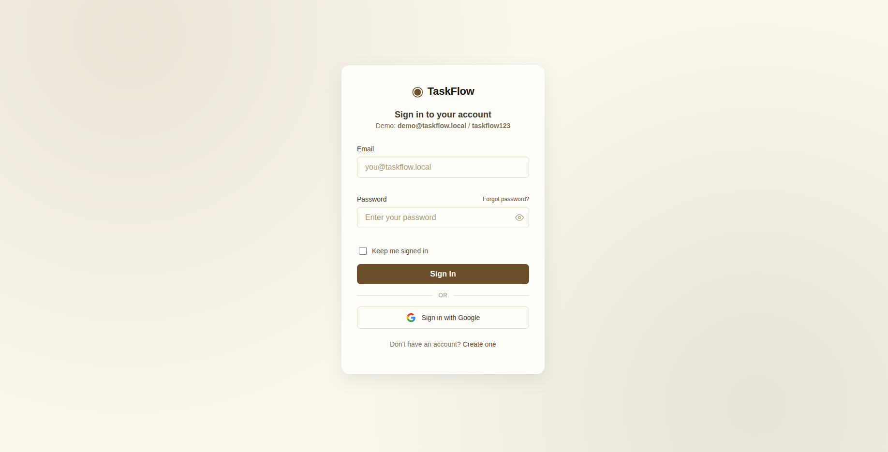

# Module Documentation

## Intern
**Name:Salman Ahmed**

## Module
**Assigned Module:** 02 — Authentication (Login & Register)

## GitHub Issue
Issue Link:https://github.com/meowryam/taskflow-management-system/issues/1

## Branch
Branch Name:feature/login-register


## Files Modified
- `src/html_files/login.html` — Login page UI with styles, form, session view, and toast feedback
- `src/html_files/register.html` — Registration page UI with form, password strength meter, and validation feedback
- `src/modules/login.js` — Login business logic: validation, demo account auth, registered-user lookup, JWT persistence, auto-restore on page load
- `src/modules/register.js` — Registration logic: data layer (localStorage CRUD), password validation, duplicate detection
- `src/modules/jwt.js` — JWT utility: token creation, signing, verification, expiry handling, localStorage persistence
- `src/modules/permissions.js` — Role-based permission matrix and access checks

## Responsibilities
- Build the authentication UI for both sign-in and registration flows
- Implement client-side form validation with accessible error messages
- Create a JWT-based session system that survives page refreshes
- Define a role-based permissions model that gates feature access
- Seed default users on first run so the app is immediately testable

## Features Implemented

### 1. Login flow (`login.html` + `login.js`)
- Email/password form with live inline validation
- Password visibility toggle (eye icon)
- "Forgot password?" mock flow that shows a demo toast
- Google Sign-In fallback button (simulated; GSI library intentionally skipped for sandboxed demo)
- Pre-seeded **demo account**: `demo@taskflow.local` / `taskflow123` (role: Product Manager)
- Falls back to checking users registered via localStorage (synced with `register.js`)
- "Keep me signed in" checkbox (UI only, all sessions persist by default via JWT)

### 2. Registration flow (`register.html` + `register.js`)
- Username, password, and role (`Admin` / `Manager` / `Team Member`) form
- Real-time password strength meter (0–5 scale: Weak → Strong)
- Checklist of password requirements updated on every keystroke
- Users are persisted to `localStorage` under the key `taskflow_users`
- Duplicate username detection (case-insensitive)
- Password visibility toggle

### 3. JWT concept (`jwt.js`)
- Implements the standard JWT structure: `base64url(header).base64url(payload).signature`
- Algorithm: simulated HS256 (deterministic hash over `header.payload + secret`)
- Each token contains claims: `name`, `role`, `email`, `iat` (issued-at), `exp` (expiry = `iat + 3600s`)
- Public API surfaced on `window.JWT`:
  | Method | Purpose |
  |---|---|
  | `create(payload)` | Builds a signed token from user claims |
  | `createWithTimestamps(payload, iat, exp)` | Creates a token with explicit timestamps (for testing) |
  | `verify(token)` | Validates signature and expiry; returns decoded payload or `null` |
  | `decode(token)` | Decodes payload without signature verification |
  | `save(token)` | Persists token to `localStorage` |
  | `get()` | Retrieves stored token |
  | `remove()` | Deletes stored token |
  | `getSession()` | Returns a verified session from storage, or `null` (auto-cleans on failure) |
  | `isExpired()` | Returns `true` if no token exists or the stored token has expired |
- **Tamper detection**: any modification to the payload or signature causes `verify()` to return `null`
- **Expiry handling**: `getSession()` and `isExpired()` both check the `exp` claim; expired tokens are automatically purged from localStorage

### 4. Session persistence across page refresh
When a user signs in:
1. The login handler creates a session object in memory
2. `persistSession()` calls `JWT.create()` with the user's name, role, and email
3. `JWT.save()` writes the token to `localStorage`

On page load (or simulated refresh):
1. `JWT.getSession()` reads the token from `localStorage`
2. `JWT.verify()` checks the signature and `exp` claim
3. If valid, the session is restored **without re-authentication**
4. The login form is hidden and the session view is shown

This means the user's role is never lost on refresh — the JWT is the single source of truth.

### 5. Role-based permissions (`permissions.js`)
Three roles with strictly hierarchical permissions:

| Permission | Admin | Manager | Team Member |
|---|---|---|---|
| `create_project` | ✓ | ✓ | |
| `delete_project` | ✓ | | |
| `edit_project` | ✓ | ✓ | |
| `archive_project` | ✓ | | |
| `manage_team` | ✓ | | |
| `create_task` | ✓ | ✓ | ✓ |
| `edit_task` | ✓ | ✓ | ✓ |
| `delete_task` | ✓ | ✓ | |
| `reassign_task` | ✓ | ✓ | |
| `view_reports` | ✓ | ✓ | |
| `export_reports` | ✓ | ✓ | |
| `manage_settings` | ✓ | | |
| `view_activity_log` | ✓ | ✓ | ✓ |
| `use_prompt_builder` | ✓ | ✓ | ✓ |
| `view_tasks` | | | ✓ |

The matrix is enforced by `Permissions.check(role, permission)` which is a pure function — deterministic, no side effects, driven entirely by the role string from the JWT payload.

### 6. Automated test suite (`tests/jwt-role-persistence.test.html`)
A standalone HTML page with 6 test suites (45+ assertions):
1. **Token creation & structure** — validates JWT shape, segments, claims, base64url encoding
2. **Tamper detection** — modified payload, forged signature, and garbage input are all rejected
3. **Expiry handling** — expired tokens are detected and auto-purged; fresh tokens return valid sessions
4. **localStorage cycle** — save → get → getSession → remove works end-to-end
5. **Role state survives page refresh** — logs in as each role, simulates a page refresh (destroys in-memory state, restores from JWT only), then asserts both the restored role and its permissions
6. **Edge cases & matrix integrity** — corrupted payloads, unknown roles, permission superset hierarchy

## AI Tool Used
-

## Prompting Techniques Used
- Role-based
- Context-rich
- Constraint-based

## Prompt(s) Used
## Prompt 1
```text
Act as a senior frontend engineer building a module for a task management 
system called TaskFlow.

Context:
- This is the Login page for the Authentication / User Selector module.
- The existing user database/data structure is defined in the /scripts 
  folder — read and reuse that exact structure, do not invent a new one 
  or add extra fields.
- Follow the existing theme and design tokens/variables from 
  src/style/style.css — do not introduce new colors, fonts, or spacing 
  values outside that theme.
- Write the output in exactly two files:
  1. login.html — the page structure/markup only, linking to style.css 
     and login.js
  2. login.js — all logic (form handling, validation, LocalStorage 
     session handling, Google login placeholder)
- Support two login methods:
  1. Username + password (checked against existing users data in /scripts)
  2. "Sign in with Google" button (I will wire up the actual Google auth 
     separately — for now just add the button, a handler function 
     placeholder called handleGoogleLogin(), and UI for it)
- Roles are: Admin, Manager, Team Member.

Task:
Build a simple Login page that:
1. Takes username and password as input for standard login.
2. Checks credentials against the existing users data (from /scripts).
3. Includes a "Sign in with Google" button that calls a placeholder 
   handleGoogleLogin() function (I will implement the real Google logic 
   myself, do not fake or simulate Google's response).
4. On successful login (either method), sets the active logged-in user 
   and stores their session in LocalStorage so it survives a page refresh.
5. On failure, shows a clear inline error message — no silent failures.
6. Includes a Logout action that clears the active session but keeps 
   stored user data intact.

Constraints:
- Output must be split into login.html and login.js only — no inline 
   <script> or <style> blocks, no separate CSS file (reuse style.css).
- Do NOT add registration logic here (separate page/file).
- Do NOT fabricate a fake Google login flow — just the button + a clearly 
   named placeholder function I can hook real logic into later.
- Do NOT add password reset, "remember me," or any feature beyond login 
   + logout + the Google button placeholder.
- Keep logic (auth checks, session handling) separate from markup — all 
   JS goes in login.js, none inside login.html.
- Use plain, clean, well-named functions — no unnecessary libraries.
- Use existing class names / CSS variables from style.css wherever 
   possible instead of creating new ones.

Edge cases to handle:
- Empty username or password field on submit.
- Username exists but password is wrong.
- Username does not exist at all.
- Page refresh while logged in — user must stay logged in with correct 
   role, regardless of which method they logged in with.

Output format:
- Provide login.html code first, then login.js code.
- Clearly mark where the real Google login logic will need to be plugged in.
- Briefly explain how session persistence works so I can test it manually.


```
## Prompt 2

```text
Act as a senior frontend engineer building a module for a task management 
system called TaskFlow.

Context:
- This is the Register page for the Authentication / User Selector module.
- The existing user database/data structure is defined in the /scripts 
  folder — read and match that exact structure when creating new users, 
  do not add extra fields or change the schema.
- Follow the existing theme and design tokens/variables from src/style/ 
  — do not introduce new colors, fonts, or spacing values outside that 
  theme.
- Registration uses username and password only (no email field, no 
  Google/OAuth, no third-party sign-up).
- Roles available at registration: Admin, Manager, Team Member.

Task:
Build a simple Register page that:
1. Takes username, password, and role as input.
2. Validates that all fields are filled before submitting.
3. Prevents duplicate usernames (checks against existing users from 
   /scripts data).
4. On success, adds the new user into the existing user data structure 
   (matching /scripts format) and shows a clear success message.
5. On failure (duplicate username, empty fields), shows a clear inline 
   error message.

Constraints:
- Do NOT add login logic here (that's a separate page).
- Do NOT add email verification, password strength meters, social 
   sign-up, or any feature beyond basic registration.
- Keep logic (validation, saving user data) separate from UI rendering 
   code.
- Use plain, clean, well-named functions — no unnecessary libraries.

Edge cases to handle:
- Empty username or password on submit.
- Username already exists in the data.
- Role not selected.
- Newly registered user should immediately be usable on the Login page 
   without a refresh being required to "see" them.

Output format:
- Provide the code for the register page/component.
- Briefly explain how new users get saved into the existing data 
   structure so I can verify it manually against /scripts.
```


## Testing Performed
- [x] Login with demo account 
- [x] Login with registered users 
- [x] Registration of new users with valid inputs
- [x] Registration rejection for duplicate username
- [x] Password strength meter real-time feedback
- [x] Logout clears JWT from localStorage
- [x] Page refresh restores session without re-login (open DevTools → Application → Local Storage → `taskflow_jwt`)
- [x] Expired token is cleaned up and session is lost
- [x] Manual tampering of the JWT in DevTools causes session loss on next access
- [x] Open `tests/jwt-role-persistence.test.html` in browser — all 45+ assertions pass

## Screenshots




## Notes
- All auth is client-side only (no backend). The JWT implementation is a **concept demonstration** — signature uses a deterministic hash for reproducibility, not a cryptographically secure HMAC. In production the server would sign tokens with a real secret and clients would only store/forward them.
- The Google Sign-In button is a **placebo fallback** that simulates a login with a fake identity. The production GSI library (`accounts.google.com/gsi/client`) is intentionally not loaded in this sandboxed demo.
- The `.env` file at the project root contains real Google OAuth credentials and should **not** be committed to version control. It is excluded only by `.gitignore`, which is essential to maintain.
- Registration stores passwords in **plaintext** in localStorage — this is acceptable for the demo scope but would require hashing (e.g. bcrypt) on a real backend.
- The `taskflow_users` key in localStorage (managed by `register.js`) and the `taskflow_jwt` key (managed by `jwt.js` / `login.js`) are independent: the former stores the user database, the latter stores the active session token.
