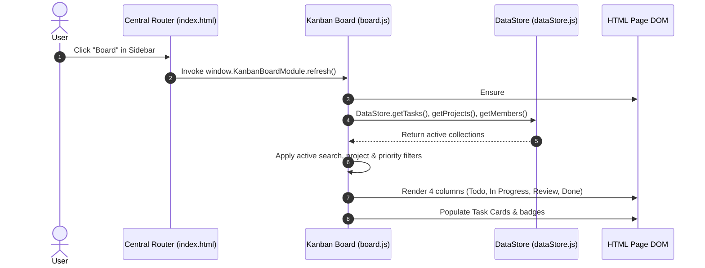
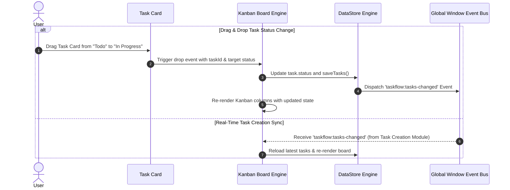

# 📋 Module 05: Kanban Task Board Management

<div align="center">


</div>

---

## 📌 Executive Summary

The **Kanban Task Board Module** provides an interactive, self-contained **4-column task management surface** (`Todo`, `In Progress`, `Review`, `Done`) inside the TaskFlow application shell. It features full **drag-and-drop state updates**, multi-criteria real-time filtering (search, project, priority), responsive grid layouts, and automatic real-time event synchronization when new tasks are created across the application.

> [!NOTE]
> **Design Philosophy**: Built with pure Vanilla JavaScript (IIFE pattern), zero external runtime dependencies, and strict module boundary isolation to ensure 100% interoperability with team-contributed modules.

---

## 👤 Intern & Module Identification

| Attribute | Details |
| :--- | :--- |
| **Developer Name** | **Muhammad Bilal** |
| **Role & Responsibilities** | Frontend Developer & Module Engineer (Module 05) |
| **Assigned Feature** | Interactive Kanban Task Board & Navigation Router Integration |
| **Branch Name** | `docs/intern-5-documentation` |
| **Target Repository** | `taskflow-management-system` |

---

## 🗂️ 1. File Structure & Responsibilities

```text
taskflow-management-system/
├── index.html                           # App shell, section container & router integration
├── src/
│   ├── dataStore.js                     # LocalStorage storage engine & custom event bus
│   ├── modules/
│   │   └── board.js                     # Kanban board component logic & view controller
│   └── styles/
│       └── board.css                    # Kanban columns, drag feedback, badges & responsiveness
└── docs/
    └── interns/
        └── 05-task-board.md             # Technical module documentation
```

### Component Responsibility Breakdown

| File Path | Role & Key Responsibilities |
| :--- | :--- |
| [`src/modules/board.js`](file:///c:/Users/Laptop%20House/Desktop/taskflow-management-system/src/modules/board.js) | Manages HTML mounting, column rendering, search/filter chaining, drag-and-drop events, card creation, and status mutation persistence. |
| [`src/styles/board.css`](file:///c:/Users/Laptop%20House/Desktop/taskflow-management-system/src/styles/board.css) | Defines 4-column responsive CSS grid, card glassmorphism, drag-over highlights, status dropdown styling, and mobile fallbacks. |
| [`index.html`](file:///c:/Users/Laptop%20House/Desktop/taskflow-management-system/index.html) | Includes stylesheet tag, sidebar navigation entry (`#nav-board`), script invocation, and centralized router registration. |

---

## 🔄 2. Architecture & Data Flow

### A. View Initialization & Dynamic Mounting Workflow



### B. Drag-and-Drop & Event-Driven Auto-Synchronization



---

## 🎯 3. Feature Matrix & Functional Specifications

| Feature Icon | Feature Name | Description & Technical Implementation | Status |
| :---: | :--- | :--- | :---: |
| 📊 | **4-Column Kanban** | Renders columns for `Todo`, `In Progress`, `Review`, and `Done` with live task count badges on column headers. | `Completed` |
| 🔍 | **Live Search** | Case-insensitive instant filtering across task titles and descriptions. | `Completed` |
| 📁 | **Project Filtering** | Filters board cards by selected project ID (`projectId`). | `Completed` |
| ⚡ | **Priority Filtering** | Dynamically filters cards by priority (`High`, `Medium`, `Low`). | `Completed` |
| 🖐️ | **Drag & Drop** | Native HTML5 Drag-and-Drop for seamlessly dragging cards between status columns. | `Completed` |
| 🔽 | **Status Select Dropdown** | Inline status selector on every task card for rapid accessibility updates. | `Completed` |
| 🏷️ | **Rich Metadata Badges** | Visual priority tags (`badge--high`, `badge--medium`, `badge--low`), due dates, and member avatars with hover tooltips. | `Completed` |
| 🔄 | **Event Auto-Sync** | Subscribes to `taskflow:tasks-changed` to automatically sync when tasks are added in other tabs/modules. | `Completed` |
| 📦 | **Empty State View** | Displays friendly feedback (`📋 No tasks in [Status]`) when columns contain no items. | `Completed` |

---

## 💻 4. Key Code Implementations

### A. Multi-Criteria AND-Chained Filtering (`board.js`)

```javascript
KanbanBoard.prototype.getFilteredTasks = function () {
  var self = this;
  return this.tasks.filter(function (task) {
    // 1. Text Search Filter
    if (self.filters.search) {
      var matchTitle = task.title && task.title.toLowerCase().indexOf(self.filters.search) !== -1;
      var matchDesc = task.description && task.description.toLowerCase().indexOf(self.filters.search) !== -1;
      if (!matchTitle && !matchDesc) return false;
    }
    // 2. Project ID Filter
    if (self.filters.projectId !== 'all') {
      if (String(task.projectId) !== String(self.filters.projectId)) return false;
    }
    // 3. Priority Filter
    if (self.filters.priority !== 'all') {
      if (task.priority !== self.filters.priority) return false;
    }
    return true;
  });
};
```

### B. Task Movement & Data Persistence (`board.js`)

```javascript
KanbanBoard.prototype.moveTask = function (taskId, newStatus) {
  var task = this.tasks.find(function (t) { return String(t.id) === String(taskId); });
  if (!task || task.status === newStatus) return;

  task.status = newStatus;
  if (newStatus === 'Done') {
    task.completedAt = new Date().toISOString();
  }

  if (typeof DataStore !== 'undefined') {
    DataStore.saveTasks(this.tasks);
  }

  this.renderBoard();
};
```

---

## 🤖 5. AI Engineering & Prompting Documentation

> [!TIP]
> **Prompting Strategy**: Used role-based directives, precise interface constraints, and defensive edge-case handling to build pure Vanilla JS modules without build tools.

### Prompts Executed

```text
Role: Act as a Senior Frontend Engineer building a modular web application.
Task: Create a self-contained Kanban Task Board module in Vanilla JavaScript.

Key Constraints:
1. Pure JavaScript (IIFE pattern), no framework dependencies, no build tools.
2. Dynamically mount #board-section inside <main> if absent.
3. Fetch tasks, projects, and members from shared DataStore.
4. Render 4 columns: Todo, In Progress, Review, Done.
5. Implement HTML5 Drag-and-Drop and inline card status dropdowns.
6. Support multi-criteria filtering (search text, project ID, priority) with a Clear Filters control.
7. Listen to global window event 'taskflow:tasks-changed' for real-time task creation updates.
```

### AI Lessons & Manual Improvements
* **Module System Correction**: AI initially generated ES Module `import`/`export` statements. Converted to IIFE closure pattern (`(function() { ... })()`) to ensure zero-bundler browser compatibility.
* **Loose ID Type Matching**: Updated strict equality check `m.id === task.assignedUserId` to `String(m.id) === String(assignedId)` to handle both numeric and UUID string IDs safely.

---

## 🧪 6. Testing & Quality Verification Matrix

| Test ID | Verification Scenario | Steps Executed | Expected Output | Result |
| :---: | :--- | :--- | :--- | :---: |
| **TC-01** | **Initial Render** | Navigate to `#nav-board` | 4 columns load with header task count badges and pre-seeded task cards. | `PASS` |
| **TC-02** | **Title Search** | Type `"Sprint"` in search input | Cards filter dynamically to matching tasks in real-time. | `PASS` |
| **TC-03** | **Project Filter** | Select specific project from dropdown | Board renders only tasks associated with the chosen project. | `PASS` |
| **TC-04** | **Priority Filter** | Select `"High"` priority | Only high-priority cards display across all columns. | `PASS` |
| **TC-05** | **Reset Filters** | Click `"Clear Filters"` button | Search input & dropdowns reset to default; all cards reappear. | `PASS` |
| **TC-06** | **Drag & Drop** | Drag card from `Todo` to `In Progress` | Card moves smoothly; status updates in `DataStore` & `localStorage`. | `PASS` |
| **TC-07** | **Inline Status Select** | Change card dropdown to `"Done"` | Task moves to `Done` column instantly with completion timestamp. | `PASS` |
| **TC-08** | **New Task Auto-Sync** | Create task in Tasks page & view Board | New task automatically appears in `Todo` column without manual refresh. | `PASS` |

---

## 🤝 7. Acknowledgments & Compliance

* **Standards Compliance**: Followed TaskFlow Responsible AI Developer Policy (no committed credentials, human-verified code logic, full disclosure).
* **Cross-Browser Compatible**: Verified in Chrome, Edge, and Firefox desktop viewports.
